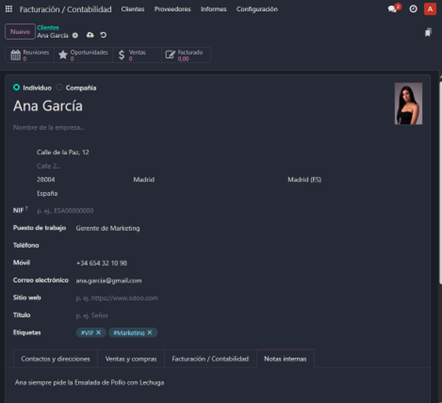
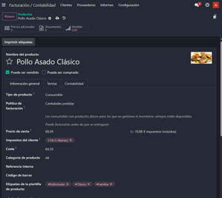
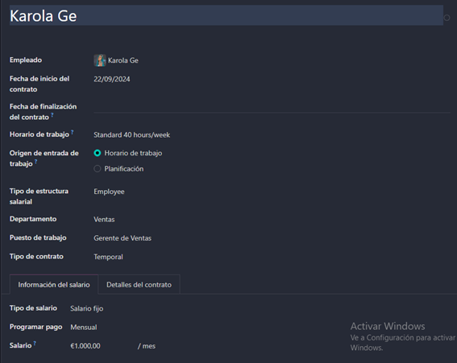
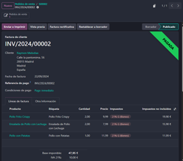
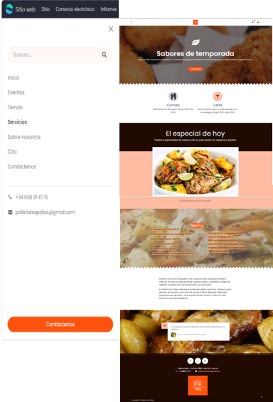
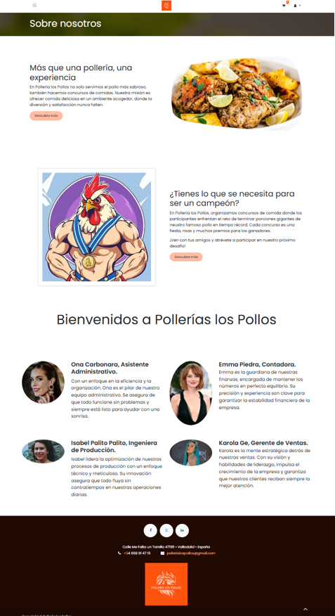
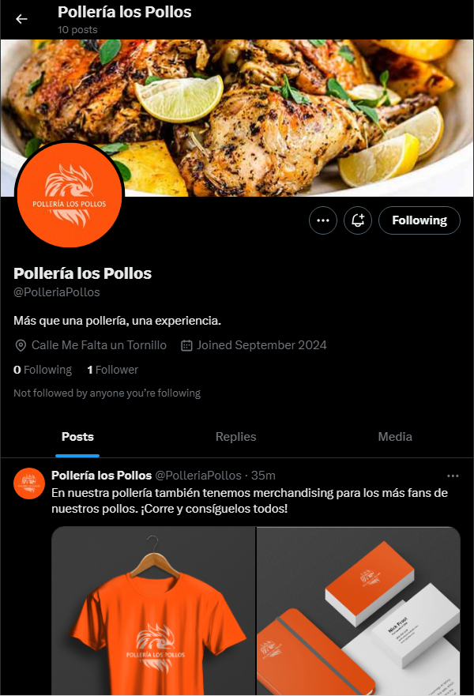
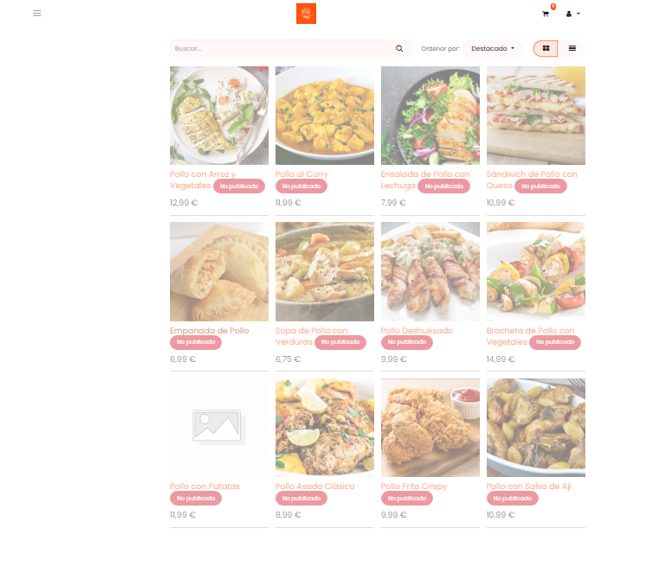
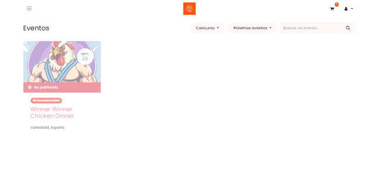
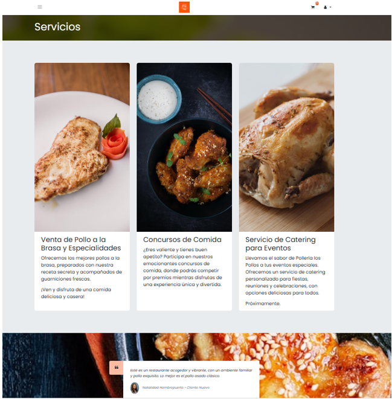

# Práctica 6: Investigación Funcionamiento ERP
## **Objetivo de la práctica** 
Investigar el funcionamiento de un ERP (Odoo) en una empresa ficticia; para ello, se puede utilizar la versión Cloud de Odoo 
(es una versión Enterprise) o la instalada en Windows 10.  
Consultar y explicar cómo realizar un proceso real en una empresa, utilizando un ERP: gestión de stocks, empleados, ventas, compras, inventario…

## Pollería los Pollos
|  | 
En esta práctica, el objetivo se basará en generar una **venta** de nuestro producto y crear un **sitio web** de nuestra empresa _Pollería los Pollos_. Se centrará en: 1. La creación de clientes y productos. 2. La realización de pedidos, facturación y pago. 3. La creación de empleados con sus contratos de trabajo. 4. Realización del sitio web.
 |
|---------------------------------------------------|----------------------------------------------------------------------------------------------------|

### Creación de clientes y productos.
<table>
  <tr>
    <td width="70%">
        En este paso, añadiremos los clientes que compraran nuestros productos.    
        En la página principal, haremos clic en <b>Facturación/Contabilidad</b>. En el menú arriba, pulsaremos en la opción de <b>Clientes -> Clientes</b>.              
        En la nueva pestaña le damos a <b>nuevo</b>, rellenamos los datos del cliente/empresa y le agregamos con el botón de la nubecita.
    </td>
    <td width="30%">
     
    </td>    
 </tr>
</table>  

<table>
  <tr>
    <td width="30%">
     
    </td> 
    <td width="70%">
        Para crear un producto iremos al módulo de <b>Contabilidad/Facturación -> Clientes -> Producto</b> y agregamos el producto.    
        Rellenamos los datos del producto. En este caso, solo se venderá a los clientes, por tanto, se marca la opción de <b>puede ser vendido</b>, ya que la 
        otra opción (<b>puede ser comprado</b>) es para si el producto puede ser comprado a los proveedores.    
        Tendremos diferentes tipos de producto para tener en cuenta.   
          -	<b>Consumible</b>: Producto físico del cuál no necesita llevar un control de stock detallado.  
          -	<b>Servicio</b>: Cualquier actividad que no implica un producto físico, sino la prestación de un servicio.  
          -	<b>Tarifa de reserva</b>: reserva o alquileres.
    </td>       
  </tr>
</table>  
&nbsp;

### Pedidos.
<table>
  <tr>
    <td width="70%">
        Después de haber creado productos, clientes, y gestionado pedidos y facturación, es igual de importante añadir la gestión de empleados dentro del 
        sistema ERP.    
        Añadiremos la información de los empleados, gestionaremos sus contratos, horarios de trabajo, etc. 
        En la página inicial, entraremos en el módulo de <b>Empleados</b>. Allí, pulsaremos la opción de nuevo, rellenaremos sus datos y guardamos. 
        En la opción de departamentos, se podrán añadir directamente, o con la opción de <b>Departamentos -> nuevo</b>. Al igual que los horarios de trabajo. 
            
        Una vez creado al empleado generaremos un contrato, ya que esto permitirá <b>gestionar las condiciones laborales</b> del empleado. 
        Para ello, en el mismo módulo, pulsaremos la opción <b>Empleados -> Contratos</b>b> y agregaremos un <b>CONTRATO</b>.
        Referenciaremos el empleado con el contrato y rellenaremos el contrato.
    </td>
    <td width="30%">
     
    </td>    
 </tr>                                                           
</table>  
&nbsp;

### Facturación y pago.
<table>
  <tr>
    <td width="30%">
     
    </td>
    <td width="70%">
        Una vez confirmado el pedido, podremos crear una factura de dicho pedido. Habrá 3 tipos de factura:  
        -	<b>Factura normal</b>. 
        -	<b>Anticipo (porcentaje)</b>. 
        -	<b>Anticipo (importe fijo)</b>. 
        Una vez elegido el tipo de factura que queremos utilizar, creamos el <b>borrador de la factura</b>. 
        Confirmada la factura, nos saldrá la opción de <b>realizar pago</b> para llevar un registro.  
        Una vez pagada, se mostrará la factura del cliente como <b>PAGADA</b>.  
      Para ver la información de un cliente, tendremos que darle clic en su <b>perfil</b> y nos saldrá la información sobre él, como las ventas realizadas o 
     la facturación.
    </td>
 </tr>                                                           
</table>  
&nbsp;

### Creación de empleados con sus contratos de trabajo.
<table>
  <tr>
    <td width="70%">
        Después de haber creado productos, clientes, y gestionado pedidos y facturación, es igual de importante añadir la gestión de empleados dentro del 
        sistema ERP.    
        Añadiremos la información de los empleados, gestionaremos sus contratos, horarios de trabajo, etc. 
        En la página inicial, entraremos en el módulo de <b>Empleados</b>. Allí, pulsaremos la opción de nuevo, rellenaremos sus datos y guardamos. 
        En la opción de departamentos, se podrán añadir directamente, o con la opción de <b>Departamentos -> nuevo</b>. Al igual que los horarios de trabajo. 
            
        Una vez creado al empleado generaremos un contrato, ya que esto permitirá <b>gestionar las condiciones laborales</b> del empleado. 
        Para ello, en el mismo módulo, pulsaremos la opción <b>Empleados -> Contratos</b> y agregaremos un <b>CONTRATO</b>.
        Referenciaremos el empleado con el contrato y rellenaremos el contrato.
    </td>
    <td width="30%">
     
    </td>    
 </tr>                                                           
</table>  
&nbsp;

### Realización del sitio web.
#### Creación de eventos
Dentro de la página web, se pueden crear productos y muchos más elementos. En nuestro caso, recalcaremos en la creación de eventos a los clientes.
Es importante darle promoción a este apartado ya que nuestra empresa organizará concursos de comida a los clientes, los cuales ganarán diferentes premios.   
Para crear un evento, iremos a **Evento -> nuevo** y rellenaremos los datos, como el nombre, la fecha, la ubicación, etc. Además de estos datos, también se pueden definir categorías para organizar mejor los eventos. 
Al rellenar las etiquetas, nos dará una opción de _Categoría_, donde podremos crear una nueva categoría.

#### Gestión de inscripciones y entradas
Desde la página del evento, también se puede gestionar las inscripciones y venta de entradas directamente. 
Se pueden configurar diferentes **tipos de entradas y gestionar el pago**. El cuál, después de rellenar los datos, generará un _**pdf**_ con sus entradas. 

Inicio                               | Sobre Nosotros                                     | Twitter     			                    
:------------------------------------------:|:-------------------------------------------:|:-------------------------------------------:|
  |  | 

 Tienda                           |  Eventos                             
:-----------------------------------------:|:--------------------------------------------:|
| |
 
 Contáctenos                       | Servicios
:-----------------------------------------------:|:-------------------------------------:|
| |

 
 

<table>
  <tr>
    <th>Nota Final de la Práctica</th>
  </tr>
  <tr>
    <td>10 (Muy completo)</td>
  </tr>
</table>

 

---

  <h2>¡Disfruta de la Práctica!</h2>

>_IES Ribera de Castilla 24/25._
